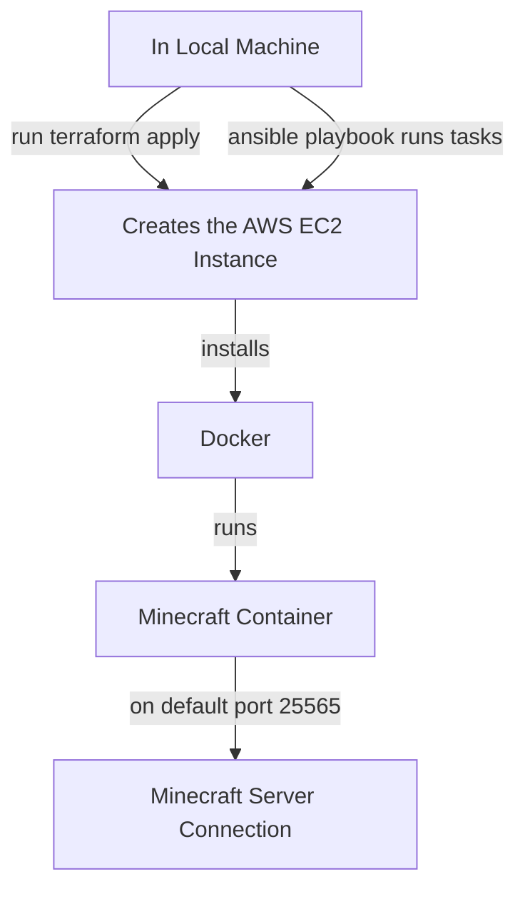

# Minecraft Server Automated (Infrastructure as Code)

## Background

We will set up a fully automated configuration and setup of a Minecraft server using the tools discussed in this course. This was done using AWS IaC tools which allowed for automation configured through scripts.

## Requirements

### Pipeline

1. **Terraform** - Created the AWS infrastructure such as the EC2 instance and the necessary security groups that controls what traffic is allowed in
2. **Ansible** - Configures the server Terraform has created for us. It helped install Docker, started that service and automated it to start whenever the server reboots, created the Minecraft systemd service which tells our operating system how to run Minecraft, and lastly starts up the Minecraft service.

### Tools

- [Terraform](https://developer.hashicorp.com/terraform/install) >= 1.5
- [Ansible](https://docs.ansible.com/ansible/latest/installation_guide/index.html) >= 9.0
- [nmap](https://nmap.org/download.html) (for verification)
- [AWS CLI](https://aws.amazon.com/cli/)

### Credentials

- AWS Academy Learner Lab credentials (`aws_access_key_id`, `aws_secret_access_key`, `aws_session_token`) saved to `~/.aws/credentials`
- AWS key pair with the `.pem` file saved to `~/.ssh/labsuser.pem`

### Environment

No environment variables are required. AWS credentials are read automatically from `~/.aws/credentials`.

## Diagram

