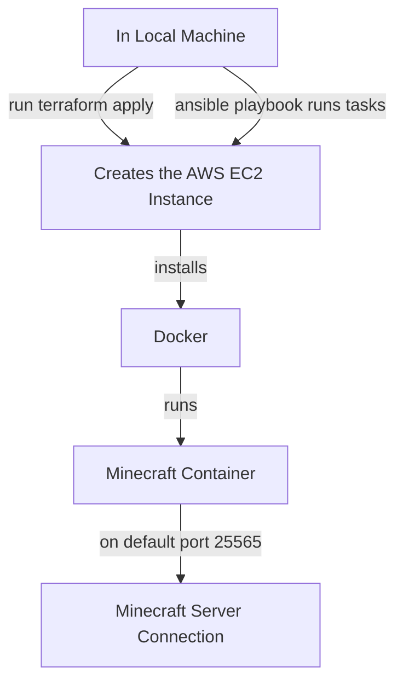

# Minecraft Server Automated (Infrastructure as Code)

## Background

We will set up a fully automated configuration and setup of a Minecraft server using the tools discussed in this course. This was done using AWS IaC tools which allowed for automation configured through scripts.

## Requirements

### Pipeline

1. **Terraform** - Provisions the AWS infrastructure such as the EC2 instance and the necessary security groups that controls what traffic is allowed in
2. **Ansible** - Configures the server Terraform has created for us. It helped install Docker, started that service and automated it to start whenever the server reboots, created the Minecraft systemd service which tells our operating system how to run Minecraft, and lastly starts up the Minecraft service.

### Tools

- [Terraform](https://developer.hashicorp.com/terraform/install)
- [Ansible](https://docs.ansible.com/ansible/latest/installation_guide/index.html)
- [nmap](https://nmap.org/download.html)
- [AWS CLI](https://aws.amazon.com/cli/)

### Credentials

- AWS Academy Learner Lab credentials (`aws_access_key_id`, `aws_secret_access_key`, `aws_session_token`) saved to `~/.aws/credentials`
- AWS key pair with the `.pem` file saved to `~/.ssh/labsuser.pem`

### Environment

No environment variables are required. AWS credentials are read automatically from `~/.aws/credentials`.

## Diagram of Major Steps in Pipeline



## Commands

### Step 1: Create and Clone the Repository into your terminal

- Click new repository in Github.
- Click the green **<> Code** button and copy the https link

```bash
git clone https://github.com/YOUR_USERNAME/minecraft-iac.git
cd minecraft-iac
```

- Clone the repository to your local machine and navigate into it.

### Step 2: Configure AWS Credentials

- Start your AWS lab
- Copy your credentials from the AWS Academy Learner Lab by clicking **AWS Details** at the top of the page
- Save them to your credentials file:

```bash
mkdir -p ~/.aws
code ~/.aws/credentials
```

Paste in your credentials in the following format:

```
[default]
aws_access_key_id = YOUR_KEY
aws_secret_access_key = YOUR_SECRET
aws_session_token = YOUR_TOKEN
```

### Step 3: Set up Infrastructure with Terraform

```bash
cd terraform
terraform init
terraform apply -var="key_name=vockey" -var="your_ip=$(curl -s ifconfig.me)/32"
```

- Use the `terraform init` command to download the AWS provider plugin
- Then use `terraform apply` command to create the EC2 instance and security group on AWS.
- Once that is completed, copy the output IP address for the next step.

### Step 4: Configure the Server with Ansible

- Update the `ansible/inventory.ini` file with the IP address from the previous step, then run:

```bash
cd ../ansible
ansible-playbook -i inventory.ini playbook.yml
```

- Ansible will automatically connect to the instance and will begin installing Docker, create the Minecraft systemd service, and start the server.

### Step 5: Confirm the Server is up and Running

- Give the server about a minute to fully boot up, then run:

```bash
nmap -sV -Pn -p T:25565 YOUR_IP
```

- Confirm you see `25565/tcp open minecraft` which lets you know the server is live.

## How to connect to the Minecraft Server

- Once you confirm the server live, open Minecraft, navigate to **Multiplayer**, click **Add Server**, enter your EC2 public IP address as the server address

## Sources

- [Terraform](https://registry.terraform.io/providers/hashicorp/aws/latest/docs)
- [Ansible](https://docs.ansible.com)
- [Docker](https://hub.docker.com/r/itzg/minecraft-server)
- [systemd Service](https://www.freedesktop.org/software/systemd/man/systemd.service.html)
- [GitHub Markdown Syntax](https://docs.github.com/en/get-started/writing-on-github/getting-started-with-writing-and-formatting-on-github/basic-writing-and-formatting-syntax)
